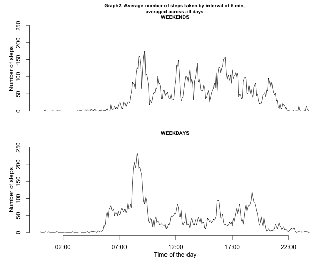

Reproducible Research: Peer Assessment 1
========================================= 


This assignment makes use of data from a personal activity monitoring device. This device collects data at 5 minute intervals through out the day. The data consists of two months of data from an anonymous individual collected during the months of October and November, 2012 and include the number of steps taken in 5 minute intervals each day.

##Loading and preprocessing the data

The first step is to download, unpack and read the data. We also load the package *lubridate*.

```r
if(!file.exists("activity.zip")) {download.file("https://d396qusza40orc.cloudfront.net/repdata%2Fdata%2Factivity.zip", "activity.zip", method = "curl")}
if(!file.exists("activity.csv")) {unzip("activity.zip", exdir = "./")}
activity_raw <- read.csv("./activity.csv", 
                         header = TRUE, 
                         stringsAsFactors = FALSE, 
                         na.strings = "NA", 
                         colClasses = c("integer", "character", "integer"))
```

The data is processed in order to create a variable with date and time of the mesurements. We also load the package *lubridate*.


```r
library(lubridate)
activity <- data.frame(steps = activity_raw$steps)
activity$interval <- formatC(activity_raw$interval, width = 4, flag = "0")
activity$interval <- paste(substr(activity$interval, 1, 2), substr(activity$interval, 3, 4), "00", sep = ":")
activity$date.time <- paste(activity_raw$date, activity$interval)
activity$date.time <- ymd_hms(activity$date.time)
```

##What is mean total number of steps taken per day?

For this question missing values are ignored. The first chunk of the code calculate the total number of steps taken per day.


```r
activity1 <- activity[!is.na(activity$steps), ]#ignore missing values
activity1$date <- as.Date(activity1$date.time)#strip the time of the day, leaving the date only
summary1 <- aggregate(steps ~ date, activity1, FUN = sum)#aggregate by the date
```

The following plot illustrates the distribution of the total number of steps taken each day. The interval of steps taken with higher frequency is between 10000 and 12000.


```r
hist(summary1$steps, breaks = 10, 
     main = "Graph1. Distribution of the total number of steps taken each day",
     xlab = "Number of steps",
     axes = FALSE,
     col = "grey", cex.main = 1)
axis(1, at = c(0, 4000, 8000, 12000, 16000, 20000, 24000))
axis(2, at = c(0, 4, 8, 12, 16))
```

 

The following table shows the median and the mean values:


```r
summary(round(summary1$steps))
```

```
##    Min. 1st Qu.  Median    Mean 3rd Qu.    Max. 
##      41    8841   10760   10770   13290   21190
```

##What is the average daily activity pattern?

Summary2 presents the aggregation of the average number of steps in the 5min-interval of the day. The data is processed in order to be plot.


```r
library(lubridate)
summary2 <- aggregate(steps ~ interval, activity1, FUN = mean)
summary2$steps <- round(summary2$steps)
summary2$interval <- paste("0000-01-01", paste(summary2$interval, sep = ":"), sep = " ") #create a POSIXcl columns with the average of the days. The fictitious date 0000-01-01 is added 
summary2$interval <- ymd_hms(summary2$interval)
```

The plot shows a clear peak at the time 8:35, with the maximum average number of steps measured. There are another smaller peaks at around 12, 16 and 19.


```r
plot(summary2$interval, 
     summary2$steps, 
     type = "l", 
     xlab = "Time of the Day", 
     ylab = "Number of Steps")
abline(v = summary2$interval[which.max(summary2$steps)], col = "red")
title("Graph2. Average number of steps taken by interval of 5 min, \naveraged across all days")
text(summary2$interval[which.max(summary2$steps)] + 20000,
     y = summary2$steps[which.max(summary2$steps)] -10,
     labels = paste("At Time:", paste(hour(summary2$interval[which.max(summary2$steps)]),
                                      minute(summary2$interval[which.max(summary2$steps)]), 
                                      sep = ":"), 
                    sep = " "), 
     col = "red")
text(summary2$interval[which.max(summary2$steps)] + 20000,
     y = summary2$steps[which.max(summary2$steps)],
     labels = paste("Maximum Number of Steps: ", 
                    max(summary2$steps), 
                    sep = " "), 
     col = "red")
```

 

The maximum average number of steps is 

```r
max(summary2$steps)
```

```
## [1] 206
```
at the time

```r
paste(hour(summary2$interval[which.max(summary2$steps)]),
      minute(summary2$interval[which.max(summary2$steps)]), 
      sep = ":")
```

```
## [1] "8:35"
```

## Imputing missing values
The total number of values missing in the data is:


```r
length(activity_raw[(is.na(activity_raw$steps)),1])
```

```
## [1] 2304
```

A new dataset is created with the missing values filled with the number of steps taken in each 5min-interval averaged accross all days.


```r
summary3_interval <- aggregate(steps ~ interval, activity1, FUN = mean) # average of steps per interval accross all days
summary3_interval$steps <- round(summary3_interval$steps)
activity3 <- activity
for(i in 1:length(activity3$steps)) { #across the length of the dateset
      if(is.na(activity3$steps[i])) { #each missing value is replaced
            interval <- activity3$interval[i] 
            mean <- summary3_interval[which(summary3_interval$interval == interval),2] #with the average of steps of each 5min-interval
            activity3$steps[i] <- mean
            } 
      }
rm(summary3_interval, i, interval, mean)
activity3$date <- as.Date(activity3$date.time)
summary3_day <- aggregate(steps ~ date, activity3, FUN = sum)
```

The following tables show the comparison between ignoring or replacing the missing values. The mean and the median values stay the same, as expected (having added he missing values as mean values), although the distribution is more compact as we can see from the 1st and 3rd quartiles getting closer to the median.


```r
comparison_day <- rbind(summary(summary1$steps), summary(summary3_day$steps))
```

From the analysis of the distribution, it is clear that the method chosen to fill the missing values only increases the frequency of the mode and in this case it does not seem to be a valuable strategy.


```r
#par(mfrow = c(1,2))
#par(mar = c(2.5, 3.5, 1, 0.5))
#par(mpg = c(1.5,0.5,0))
par(mfrow = c(1, 2),     
    oma = c(2, 2, 0, 0), 
    mar = c(1, 2, 3, 1.5), 
    mgp = c(2, 1, 0),    
    xpd = NA)

#replotting Graph1
hist(summary1$steps, breaks = 10, 
     cex.main = 0.8, 
     main = "Graph1. Distribution of the total number \nof steps taken each day, \nmissing values removed",
     xlab = "Number of steps",
     axes = FALSE,
     ylim = c(0, 24),
     col = "grey")
axis(1, at = c(0, 4000, 8000, 12000, 16000, 20000, 24000))
axis(2, at = c(0, 4, 8, 12, 16, 18, 20, 22, 24))
#plotting Graph3 with the filled missing values
hist(summary3_day$steps, breaks = 10,
     cex.main = 0.8,
     main = "Graph3. Distribution of the total number \nof steps taken each day, \nmissing values filled in",
     xlab = "Number of steps",
     ylab = "",
     axes = FALSE,
     ylim = c(0, 24),
     col = "grey")
axis(1, at = c(0, 4000, 8000, 12000, 16000, 20000, 24000))
```

-1.png) 

## Are there differences in activity patterns between weekdays and weekends?

Create a new factor variable in the dataset with two levels – “weekday” and “weekend” indicating whether a given date is a weekday or weekend day.


```r
library(lubridate)
day_type <- vector(mode = "character", length = length(activity1$steps))
for(i in 1:length(activity1$date.time)) {
      if(weekdays(activity1$date.time[i]) == "Saturday" || weekdays(activity1$date.time[i]) == "Sunday")  { day_type[i] <- "weekend"  }
      else { day_type[i] <- "weekday"   }
      }
activity4 <- cbind(activity1, day_type = as.factor(day_type))
summary4 <- aggregate(steps ~ interval + day_type, activity4, FUN = mean)
summary4$steps <- round(summary4$steps)
summary4$interval <- paste("0000-01-01", paste(summary4$interval, sep = ":"), sep = " ") #create a POSIXcl columns with the average of the days. The fictitious date 0000-01-01 is added 
summary4$interval <- ymd_hms(summary4$interval)
```

Make a panel plot containing a time series plot (i.e. type = “l”) of the 5-minute interval (x-axis) and the average number of steps taken, averaged across all weekday days or weekend days (y-axis).


```r
par(mfrow = c(2, 1),     
    oma = c(2, 2, 0, 0), 
    mar = c(1, 2, 3, 1.5), 
    mgp = c(2, 1, 0),    
    xpd = NA)
#plot above WEEKEND
plot(summary4$interval[summary4$day_type == "weekend"],
     summary4$steps[summary4$day_type == "weekend"],
     axes = FALSE,
     type = "l",
     xlab = "",
     ylab = "Number of steps",
     ylim = c(0, 250),
     cex.main = 0.8,
     main = "Graph2. Average number of steps taken by interval of 5 min, \naveraged across all days \nWEEKEND"
     )

axis(2, at = c(0,50, 100, 150, 200, 250))
#plot below WEEKDAY
plot(summary4$interval[summary4$day_type == "weekday"],
     summary4$steps[summary4$day_type == "weekday"],
     axes = FALSE,
     type = "l",
     xlab = "Time of the day",
     ylab = "Number of steps",
     ylim = c(0, 250),
     cex.main = 0.8,
     main = "WEEKDAYS")

axis.POSIXct(x = summary4$interval[summary4$day_type == "weekday"], side = 1)
axis(2, at = c(0,50, 100, 150, 200, 250))
```

 

The following table shows a summary of the of the steps across all intervals and days by Weekdays/Weekends


```r
tapply(summary4$steps, summary4$day_type, 
       function(x) {
             c(MINIMUM = round(min(x)), 
               MEAN = round(mean(x)), 
               MEDIAN = round(median(x)), 
               MAXIMUM = round(max(x)),
               STANDARD.DEVIATION = round(sd(x), digits = 2),
               COEFF.VARIATION = round((sd(x)/mean(x)), digits = 2)
               )
             }
       )
```

```
## $weekday
##            MINIMUM               MEAN             MEDIAN 
##               0.00              35.00              24.00 
##            MAXIMUM STANDARD.DEVIATION    COEFF.VARIATION 
##             234.00              42.26               1.20 
## 
## $weekend
##            MINIMUM               MEAN             MEDIAN 
##               0.00              43.00              32.00 
##            MAXIMUM STANDARD.DEVIATION    COEFF.VARIATION 
##             175.00              44.41               1.03
```


